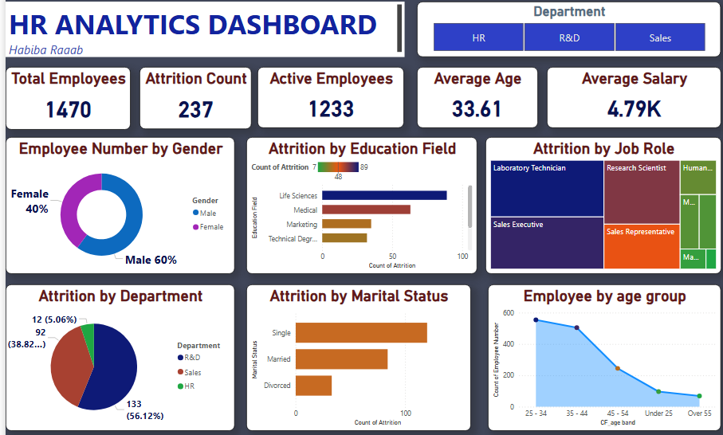

# habiba-portfolio-
# Habiba Ragab | Power BI Specialist & Data Analyst 📊

.png)

## 👤 About Me
I am a first-year Information Technology student with a passion for data storytelling. I focus on transforming complex datasets into clear, actionable insights using Power BI and Excel. My goal is to bridge the gap between data and strategic decision-making while constantly improving my technical and communication skills.

## 🛠 Technical Skills
- **Data Analysis & Visualization:** Power BI, Excel
- **Data Transformation:** Power Query, Data Cleaning
- **Database & Modeling:** SQL, DAX
- **Design:** KPI Design & Dashboard Layout

---

### 📉 Project 1: HR Attrition Analysis
This dashboard focuses on employee turnover, analyzing attrition rates by job role, department, and gender diversity to improve retention strategies.

---

### 🌍 Project 2: Global Demographics & Trends
A comprehensive view of global data, visualizing geographic distributions and key demographic metrics across different regions.

---

### 🎓 Project 3: Education and Growth Metrics
Analyzing learning progress and professional development data to track growth and educational milestones within the organization.

---

## 📬 Let's Connect
- **LinkedIn:** [linkedin.com/in/habibaragab4](https://www.linkedin.com/in/habibaragab4)
- **Email:** [habibaragab482006@gmail.com](mailto:habibaragab482006@gmail.com)
